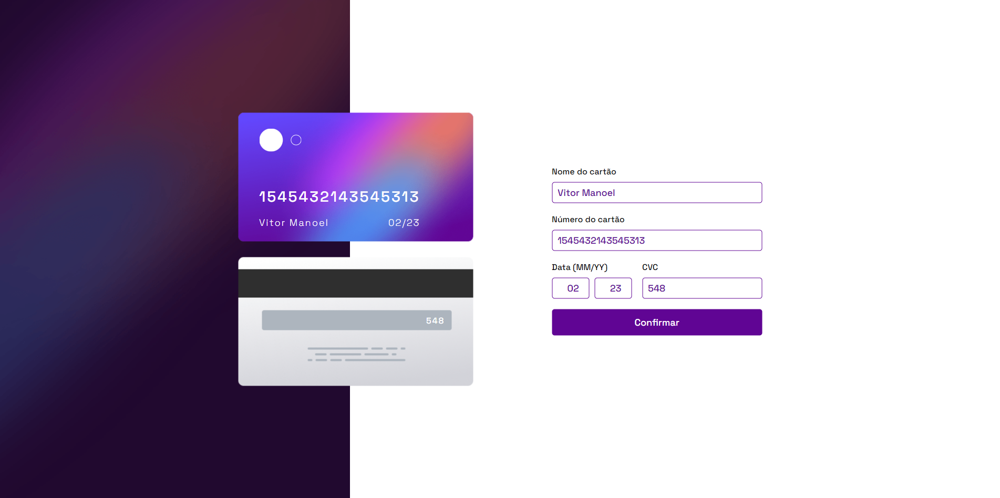
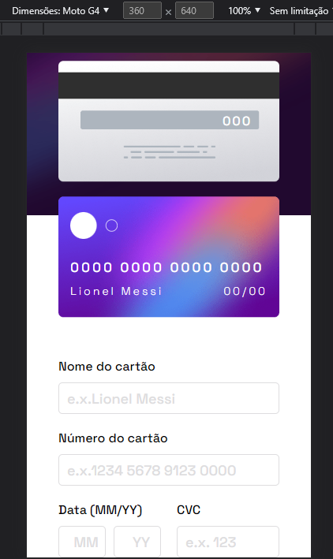
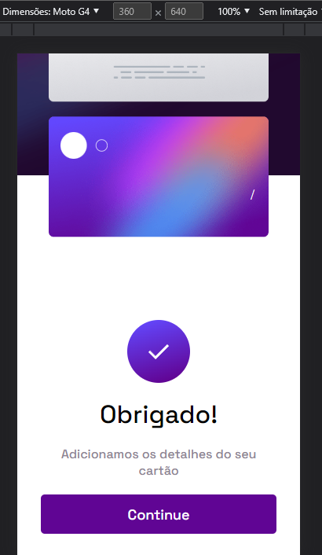

# Projeto Cartão Dinâmico:credit_card:

* Projeto feito em HTML, CSS e JAVASCRIPT.

- Cartão com verificação dos inputs, e modal de confirmação. 

  

  

## Responsivo:sunglasses:

- Totalmente responsivo para qualquer formato de mídia.

  

